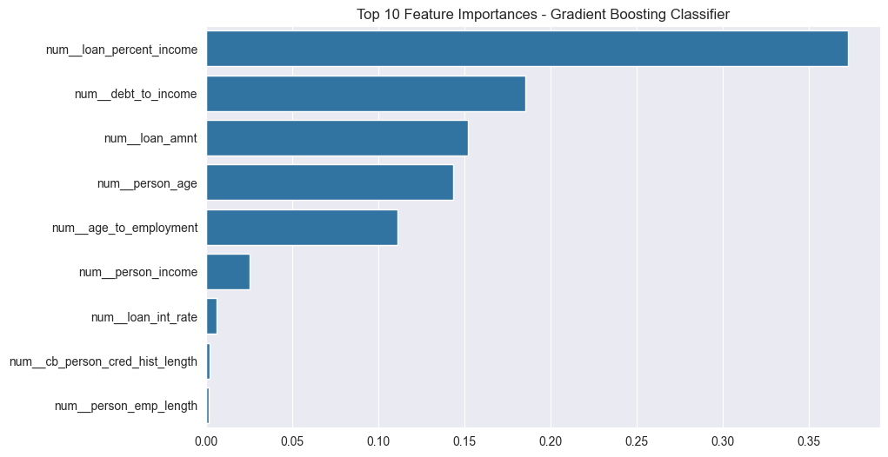
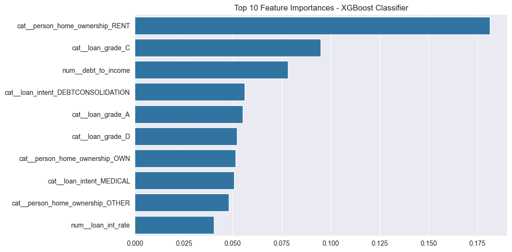

# Credit Risk Assessment Project

## Overview
This project implements a machine learning pipeline to predict credit risk using a dataset of loan applicants. It utilizes various data preprocessing techniques, feature engineering, and advanced machine learning models to accurately classify loan status.

## Dataset
The dataset used in this project is sourced from Kaggle: [Credit Risk Dataset](https://www.kaggle.com/datasets/laotse/credit-risk-dataset)

It includes various features related to loan applicants such as:
- Personal information (age, income, employment length)
- Loan details (amount, interest rate, grade)
- Credit history

## Project Structure
1. **Data Loading and Exploration**
   - Initial data analysis
   - Missing value check
   - Distribution analysis of features

2. **Feature Engineering**
   - Creation of new features:
     - Debt to Income Ratio
     - Age to Employment Ratio

3. **Preprocessing**
   - Handling of numerical and categorical data
   - Scaling of numerical features
   - One-hot encoding of categorical features

4. **Model Development**
   - Implementation of two models:
     - Gradient Boosting Classifier
     - XGBoost Classifier
   - Feature selection using Random Forest

5. **Model Evaluation**
   - Performance metrics (Accuracy, Precision, Recall, F1-Score)
   - Confusion Matrix
   - ROC AUC Score
   - Cross-validation

6. **Feature Importance Analysis**
   - Visualization of top features for both models

## Key Findings
- XGBoost outperforms Gradient Boosting in terms of accuracy, recall, and ROC AUC scores.
- XGBoost achieved 93% accuracy compared to 90% for Gradient Boosting.
- XGBoost shows better performance in detecting the minority class (class 1).
- Top features for prediction include loan percent income, debt to income ratio, and loan amount.

## Visualizations
The project includes several visualizations:
1. Distribution of numerical and categorical variables
2. Correlation matrix of numerical variables
3. Feature importance plots for both models
   - 
   - 
## Requirements
- Python 3.x
- pandas
- numpy
- scikit-learn
- xgboost
- matplotlib
- seaborn
- plotly

## Usage
1. Clone the repository
2. Install the required packages: `pip install -r requirements.txt`
3. Run the Jupyter notebook or Python script

## Future Improvements
- Experiment with other advanced models like LightGBM or Neural Networks
- Implement more sophisticated feature engineering techniques
- Explore techniques for handling imbalanced datasets
- Develop a web application for real-time credit risk assessment

## Contributing
Contributions to this project are welcome. Please fork the repository and submit a pull request with your proposed changes.

## License
NO License
